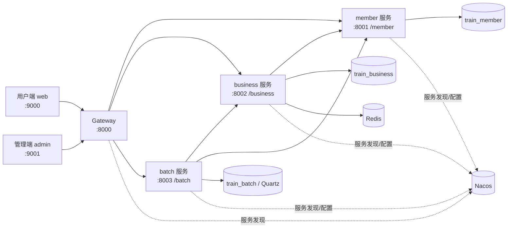

<div align="center">

# Train

一个基于 Spring Cloud + Vue 3 的火车票售票系统，包含会员、余票查询、乘车人管理、下单购票、后台车次维护和定时任务管理。


</div>

---

## 目录

- [项目简介](#项目简介)
- [核心功能](#核心功能)
- [系统架构](#系统架构)
- [技术栈](#技术栈)
- [项目结构](#项目结构)
- [环境准备](#环境准备)
- [数据库初始化](#数据库初始化)
- [本地启动](#本地启动)
- [接口调试](#接口调试)
- [部署脚本](#部署脚本)
- [开发提示](#开发提示)

## 项目简介

Train 是一个前后端分离的火车票业务系统。后端按微服务拆分为网关、会员服务、业务服务和批处理服务；前端分为用户端 `web` 和后台管理端 `admin`。

用户端负责登录、乘车人、余票查询、选座下单和我的车票；管理端负责站点、车次、车厢、座位、每日车次、秒杀令牌、订单和定时任务等后台数据维护。

## 核心功能

| 模块 | 功能 |
| --- | --- |
| 用户端 | 登录校验、乘车人管理、车票查询、余票展示、选座购票、订单查询、我的车票 |
| 后台管理端 | 站点维护、车次维护、经停站维护、车厢/座位维护、每日车次生成、每日余票维护 |
| 订单业务 | 图形验证码、下单排队、订单取消、座位售卖状态查询、秒杀令牌管理 |
| 会员服务 | 用户注册、验证码发送、登录、乘车人维护、车票记录查询 |
| 批处理服务 | Quartz 任务新增、运行、暂停、恢复、重排、删除和查询 |
| 基础支撑 | 网关路由、JWT 登录信息传递、统一响应、异常处理、日志拦截、代码生成器 |

## 系统架构



## 技术栈

| 分类 | 技术 |
| --- | --- |
| 后端 | Java 17、Spring Boot 3.0.0、Spring Cloud 2022.0.0、Spring Cloud Alibaba |
| 网关与调用 | Spring Cloud Gateway、OpenFeign、LoadBalancer、Nacos Discovery/Config |
| 数据访问 | MyBatis、PageHelper、MySQL Connector/J |
| 缓存与限流 | Redis、Spring Cache、Sentinel |
| 任务调度 | Quartz |
| 前端 | Vue 3、Vue Router、Vuex、Ant Design Vue、Axios |
| 工具模块 | MyBatis Generator、FreeMarker、Hutool |

## 项目结构

```text
train
├── admin/                 # 后台管理端，端口 9001
├── web/                   # 用户端，端口 9000
├── gateway/               # API 网关，端口 8000
├── member/                # 会员服务，端口 8001，路径 /member
├── business/              # 业务服务，端口 8002，路径 /business
├── batch/                 # 批处理服务，端口 8003，路径 /batch
├── common/                # 公共响应、异常、拦截器、JWT、工具类
├── generator/             # MyBatis / 前后端代码生成工具
├── sql/                   # 数据库建表与基础数据脚本
├── http/                  # 接口调试请求文件
├── deploy/                # 后端模块部署脚本
├── pom.xml                # Maven 聚合工程
├── mvnw / mvnw.cmd        # Maven Wrapper
└── train.jmx              # JMeter 压测脚本
```

## 环境准备

请先确认本机已准备好以下环境：

| 环境 | 说明 |
| --- | --- |
| JDK 17 | 后端模块编译与运行 |
| Maven 3.8+ | 也可以直接使用项目内的 `mvnw` / `mvnw.cmd` |
| Node.js 16+ | 前端项目运行与构建 |
| MySQL 8.x | 初始化 `train_member`、`train_business`、`train_batch` |
| Nacos | 服务注册与配置中心，默认地址 `127.0.0.1:8848`，命名空间 `train` |
| Redis | business 服务使用 Redis 做缓存和业务状态存储 |
| Sentinel Dashboard | 可选，配置里默认指向 `localhost:18080` |
| Seata | 可选，项目保留了 Seata 配置，事务组配置按 Nacos 中的实际配置调整 |

> 注意：当前 `application.properties` 中包含开发环境的数据库、Redis、Nacos 等连接信息。首次运行前建议改成本地或测试环境配置，避免误连共享环境。

## 数据库初始化

项目按服务拆分数据库：

| 数据库 | 脚本 | 说明 |
| --- | --- | --- |
| `train_member` | `sql/member.sql` | 会员、乘车人、车票记录 |
| `train_business` | `sql/business.sql` | 站点、车次、每日车次、余票、订单、秒杀令牌 |
| `train_batch` | `sql/batch.sql` | Quartz 调度表 |
| 基础数据 | `sql/init-base-data.sql` | 站点、车次、经停站、车厢等演示数据 |

建议按下面顺序执行：

```sql
-- 1. 创建数据库
CREATE DATABASE train_member DEFAULT CHARACTER SET utf8mb4 COLLATE utf8mb4_unicode_ci;
CREATE DATABASE train_business DEFAULT CHARACTER SET utf8mb4 COLLATE utf8mb4_unicode_ci;
CREATE DATABASE train_batch DEFAULT CHARACTER SET utf8mb4 COLLATE utf8mb4_unicode_ci;

-- 2. 分别执行建表脚本
-- train_member   -> sql/member.sql
-- train_business -> sql/business.sql
-- train_batch    -> sql/batch.sql

-- 3. 在 train_business 中执行基础数据
-- train_business -> sql/init-base-data.sql
```

## 本地启动

### 1. 启动基础服务

先启动 MySQL、Nacos、Redis。若需要使用 Sentinel 或 Seata，请同步启动对应服务，并检查 Nacos 命名空间、配置文件和事务组名称是否一致。

### 2. 编译后端

Windows：

```bash
mvnw.cmd clean package -DskipTests
```

macOS / Linux：

```bash
./mvnw clean package -DskipTests
```

### 3. 启动后端服务

建议按下面顺序启动：

| 顺序 | 模块 | 启动类 | 地址 |
| --- | --- | --- | --- |
| 1 | `gateway` | `com.jiawa.train.gateway.config.GatewayApplication` | `http://127.0.0.1:8000` |
| 2 | `member` | `com.jiawa.train.member.config.MemberApplication` | `http://127.0.0.1:8001/member` |
| 3 | `business` | `com.jiawa.train.business.config.BusinessApplication` | `http://127.0.0.1:8002/business` |
| 4 | `batch` | `com.jiawa.train.batch.config.BatchApplication` | `http://127.0.0.1:8003/batch` |

也可以使用 Maven 分模块运行，例如：

```bash
mvnw.cmd -pl gateway spring-boot:run
mvnw.cmd -pl member spring-boot:run
mvnw.cmd -pl business spring-boot:run
mvnw.cmd -pl batch spring-boot:run
```

通过网关访问时，请使用统一入口：

```text
http://127.0.0.1:8000/member/**
http://127.0.0.1:8000/business/**
http://127.0.0.1:8000/batch/**
```

### 4. 启动用户端

```bash
cd web
npm install
npm run web-dev
```

访问：`http://localhost:9000`

### 5. 启动管理端

```bash
cd admin
npm install
npm run admin-dev
```

访问：`http://localhost:9001`

生产环境构建命令：

```bash
# 用户端
cd web
npm run build-web-prod

# 管理端
cd admin
npm run build-admin-prod
```

## 接口调试

`http/` 目录下已经整理了常用接口请求文件，可直接用 IntelliJ IDEA、WebStorm、VS Code REST Client 等工具打开调试。

| 文件 | 说明 |
| --- | --- |
| `http/member-member.http` | 会员注册、验证码、登录等接口 |
| `http/member-passenger.http` | 乘车人接口 |
| `http/business-train.http` | 车站、车次基础数据接口 |
| `http/business-daily-train-ticket.http` | 每日车票与余票接口 |
| `http/business-confirm-order.http` | 下单、排队、取消订单接口 |
| `http/business-kaptcha.http` | 图形验证码接口 |
| `http/business-seat.http` | 座位售卖状态接口 |
| `http/batch-job.http` | Quartz 任务管理接口 |

## 部署脚本

`deploy/` 目录提供了后端模块部署脚本：

```text
deploy/deploy-gateway.sh
deploy/deploy-member.sh
deploy/deploy-business.sh
deploy/deploy-batch.sh
```

执行前请先检查脚本内的服务器路径、进程名、JAR 包位置和运行账号，确认与目标环境一致。

## 开发提示

- `common` 模块放公共能力，包含统一返回体、分页对象、异常处理、JWT 工具、登录上下文和拦截器。
- `generator` 模块用于 MyBatis 代码生成，也包含基于 FreeMarker 的前端模板生成逻辑。
- `business` 模块承担主要票务逻辑，包含站点、车次、每日车次、余票、选座、订单、验证码和秒杀令牌。
- `batch` 模块通过 Quartz 管理定时任务，并通过 Feign 调用业务服务和会员服务。
- 前端生产环境接口地址来自 `.env.prod` 中的 `VUE_APP_SERVER`，本地联调时请按实际网关地址调整环境配置。
- 项目内有 `train.jmx`，可以用 JMeter 做购票链路的压测验证。

---
